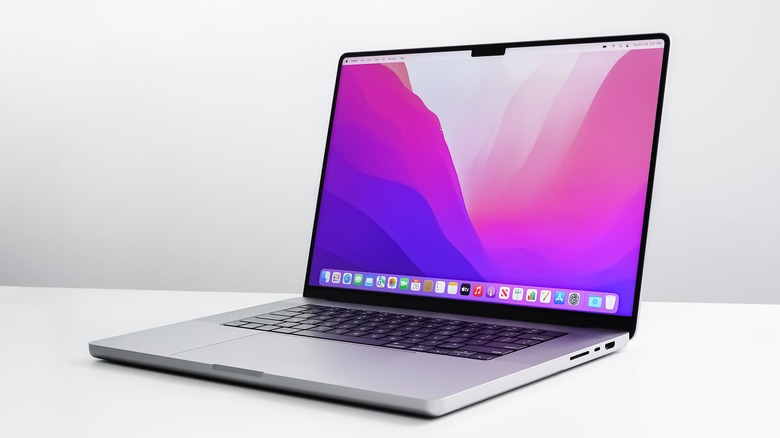

Verkefni 2 - Samsetningarskýrsla

### Inngangur

Þessi samsetningarskýrsla er um Macbook pro, 14 tommu skjá og árgerð 2023 tölvan er byggð á Apple M2 Pro örgjörva eða "chip" svo kallað hjá apple ástæðan afhverju þetta er kallað chip er útaf þetta er beinlínis ekki bara örgjörvinn eða "Cpu" á ensku. Þetta er frekar "SoC" eða system on a chip og gerir þetta þá mjög öðruvísi frá öðrum tölvum og það er svona smá ástæða fyrir því að annaðhvort hatarðu Mac vélar eða elskar þær.

### Cpu

Ég ætla samt að skilgreina chippið sem Örgjörva.
Þannig að Örgjörvinn Apple M2 Pro er kraftmikill örgjörvi og sér um öll megin atriði og vinnslu í vélinni og var hannaður fyrir proffesional Mac vélar. Þessi kubbur inniheldur bæði Cpu og Gpu ástæðan fyrir því er að fólkið hjá apple sá miklu meiri bætingar í efficiency í tölvunni og það er afhverju það er kallað SoC.

### Skjákort(Gpu)

Skjákortið er líka á Apple M2 Pro (SoC) kubbnum og það sér um svona myndvinnslu, grafík og slíkt. framleiðir allt sjónrænt

### minni (RAM)

Tölvan er með 32 GB RAM sem stendur fyrir random access memory, deilir því á milli gpu og cpu á SoC og eykur mjög mikin hraða í tölvunni "ramið" er alveg fast lóðað og ekki hægt að breyta því

### Lokaorð

Þessi hönnun gerrir MacBook Pro er létta og hraðvirka fullkomin fyrir nema sama hvað þeir eru að læra en mjög takmarkaðar breytingar á tölvu eftir kaup.

